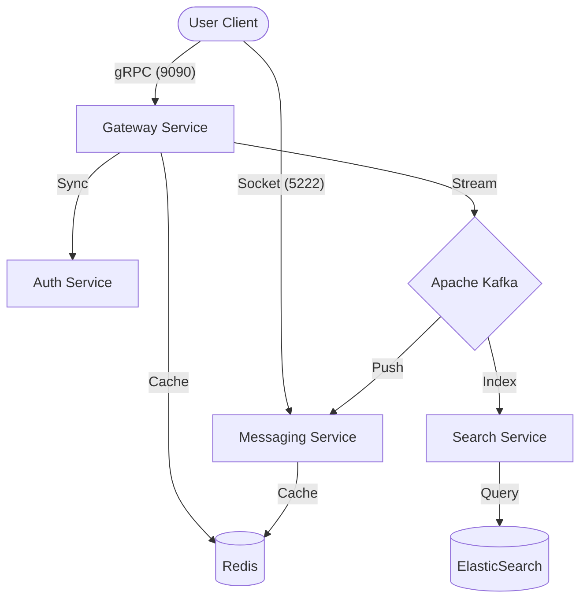

  # Hexa-Pulse 
  ### Enterprise-Grade High-Performance Messaging Infrastructure
  
  [](https://www.oracle.com/java/technologies/javase/jdk21-archive-downloads.html)
  [](https://spring.io/projects/spring-boot)
  [](https://kubernetes.io/)
  [](https://kafka.apache.org/)
  [](https://redis.io/)
  [](https://www.elastic.co/)

---

## Overview

**Hexa-Pulse** is a cutting-edge messaging platform designed to handle **tens of thousands of messages per second** with sub-millisecond latency. Built on a stateless microservices architecture, it leverages **Java 21's Virtual Threads** for massive concurrency and **End-to-End Encryption (End-to-End Encryption)** simulation to ensure absolute privacy.

> [!IMPORTANT]
> This project is designed for enterprise scalability, using Event-Driven Architecture (EDA) and non-blocking I/O (Netty/gRPC).

---

## Architecture

The system is composed of specialized microservices communicating via **gRPC** and **Kafka**.



### Core Services

| Service | Technology | Role |
| :--- | :--- | :--- |
| **Gateway** | Spring Boot, gRPC | Entry point for message ingestion & E2EE simulation. |
| **Messaging** | Netty, Kafka | Manages persistent socket connections and real-time delivery. |
| **Auth** | JWT, Redis | Stateless token-based authentication and session tracking. |
| **Search** | ElasticSearch | High-speed full-text search over message history. |

---

## Key Features

- **High Concurrency**: Powered by Java 21 **Virtual Threads** (Project Loom).
- **End-to-End Privacy**: Simulated Signal Protocol layer for message obfuscation.
- **Event-Driven**: Kafka-based asynchronous processing for elastic scalability.
- **Real-time Discovery**: Redis-backed "Online/Offline" status management.
- **Fault-Tolerant**: Self-healing microservices ready for Kubernetes.

---

## Getting Started

### Prerequisites

- Docker & Docker Compose
- Maven 3.9+
- Python 3.x (to run the test client)

### Setup & Launch

1. **Clone the repository**:
   ```bash
   git clone https://github.com/DenizBitmez/hexa-pulse.git
   cd hexa-pulse
   ```

2. **Start the Infrastructure**:
   ```bash
   docker-compose up --build -d
   ```

3. **Verify Health**:
   Wait for all services to show as `healthy`.
   ```bash
   docker ps
   ```

---

## Testing the System

### 1. Connect a Client
The Messaging Service uses standard XMPP-like socket protocol on port `5222`.
```bash
python test_client.py
```
*The client will register as `deniz` and wait for incoming messages.*

### 2. Simulate Authentication
Login to get a JWT token:
```bash
curl -X POST http://localhost:8081/auth/login -H "Content-Type: application/json" -d '{"userId": "sender123"}'
```

### 3. Search History
Full-text search over indexed messages:
```bash
curl "http://localhost:8082/search/messages?query=hello"
```

---

## Future Roadmap

- [ ] **Kubernetes Production Cluster**: Migration path from Docker Compose.
- [ ] **Istio Service Mesh**: mTLS and advanced traffic management.
- [ ] **Prometheus & Grafana**: Real-time observability dashboards.
- [ ] **Custom Netty Protocol**: Optimized binary serialization (Protobuf) over raw sockets.

---

## License
This project is licensed under the Apache License 2.0 - see [LICENSE](LICENSE) for details.

---

<div align="center">
  Built with ❤️ for High-Performance Systems
</div>
